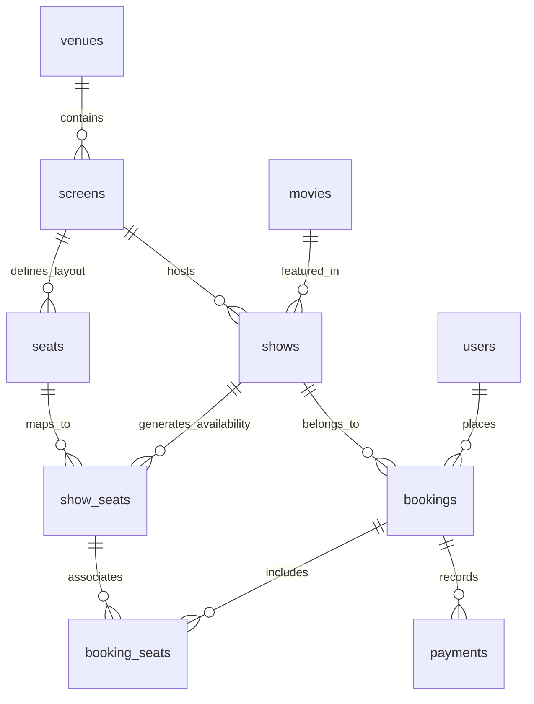

# PostgreSQL Database Schema Specification

This document details the schema design, relationships, constraints, and indexes for the High-Concurrency Ticket Booking Platform (**SeatForge**).

---

## 1. Entity-Relationship Overview



---

## 2. Core Entities & Table Definitions

### A. `users`
Stores user identities and authentication credentials.
```sql
CREATE TABLE users (
  id UUID PRIMARY KEY DEFAULT gen_random_uuid(),
  name VARCHAR(255) NOT NULL,
  email VARCHAR(255) NOT NULL UNIQUE,
  password_hash VARCHAR(255) NOT NULL,
  role VARCHAR(50) NOT NULL DEFAULT 'customer' CHECK (role IN ('customer', 'admin')),
  created_at TIMESTAMPTZ NOT NULL DEFAULT NOW(),
  updated_at TIMESTAMPTZ NOT NULL DEFAULT NOW()
);
CREATE INDEX idx_users_email ON users(email);
```

### B. `movies`
Catalog of cinematic events.
```sql
CREATE TABLE movies (
  id UUID PRIMARY KEY DEFAULT gen_random_uuid(),
  title VARCHAR(255) NOT NULL,
  description TEXT,
  duration_minutes INTEGER NOT NULL CHECK (duration_minutes > 0),
  genre VARCHAR(100) NOT NULL,
  rating VARCHAR(20) DEFAULT 'PG-13',
  poster_url VARCHAR(512),
  release_date DATE,
  created_at TIMESTAMPTZ NOT NULL DEFAULT NOW(),
  updated_at TIMESTAMPTZ NOT NULL DEFAULT NOW()
);
CREATE INDEX idx_movies_title ON movies(title);
CREATE INDEX idx_movies_genre ON movies(genre);
```

### C. `venues` & `screens`
Locations and physical auditoriums.
```sql
CREATE TABLE venues (
  id UUID PRIMARY KEY DEFAULT gen_random_uuid(),
  name VARCHAR(255) NOT NULL,
  city VARCHAR(100) NOT NULL,
  address TEXT NOT NULL,
  created_at TIMESTAMPTZ NOT NULL DEFAULT NOW(),
  updated_at TIMESTAMPTZ NOT NULL DEFAULT NOW()
);
CREATE INDEX idx_venues_city ON venues(city);

CREATE TABLE screens (
  id UUID PRIMARY KEY DEFAULT gen_random_uuid(),
  venue_id UUID NOT NULL REFERENCES venues(id) ON DELETE CASCADE,
  name VARCHAR(100) NOT NULL,
  total_seats INTEGER NOT NULL DEFAULT 0 CHECK (total_seats >= 0),
  created_at TIMESTAMPTZ NOT NULL DEFAULT NOW(),
  updated_at TIMESTAMPTZ NOT NULL DEFAULT NOW(),
  CONSTRAINT uq_venue_screen_name UNIQUE(venue_id, name)
);
CREATE INDEX idx_screens_venue_id ON screens(venue_id);
```

### D. `seats` (Physical Layout Blueprint)
Represents the static physical seating layout in an auditorium.
```sql
CREATE TABLE seats (
  id UUID PRIMARY KEY DEFAULT gen_random_uuid(),
  screen_id UUID NOT NULL REFERENCES screens(id) ON DELETE CASCADE,
  row VARCHAR(10) NOT NULL,
  number INTEGER NOT NULL CHECK (number > 0),
  seat_label VARCHAR(20) NOT NULL,
  tier VARCHAR(50) NOT NULL DEFAULT 'STANDARD' CHECK (tier IN ('STANDARD', 'PREMIUM', 'VIP')),
  created_at TIMESTAMPTZ NOT NULL DEFAULT NOW(),
  CONSTRAINT uq_screen_seat_label UNIQUE(screen_id, seat_label)
);
CREATE INDEX idx_seats_screen_id ON seats(screen_id);
CREATE INDEX idx_seats_screen_row ON seats(screen_id, row);
```

### E. `shows`
Screening schedules linking a movie to an auditorium at a specific time.
```sql
CREATE TABLE shows (
  id UUID PRIMARY KEY DEFAULT gen_random_uuid(),
  movie_id UUID NOT NULL REFERENCES movies(id) ON DELETE CASCADE,
  screen_id UUID NOT NULL REFERENCES screens(id) ON DELETE CASCADE,
  start_time TIMESTAMPTZ NOT NULL,
  end_time TIMESTAMPTZ NOT NULL,
  base_price NUMERIC(10, 2) NOT NULL CHECK (base_price >= 0),
  created_at TIMESTAMPTZ NOT NULL DEFAULT NOW(),
  updated_at TIMESTAMPTZ NOT NULL DEFAULT NOW(),
  CONSTRAINT chk_show_time CHECK (end_time > start_time)
);
CREATE INDEX idx_shows_movie_id ON shows(movie_id);
CREATE INDEX idx_shows_screen_id ON shows(screen_id);
CREATE INDEX idx_shows_start_time ON shows(start_time);
```

### F. `show_seats` (Mutable Show-Specific State)
**Central Architectural Rule**: Never store show-specific status on the global `seats` table.
```sql
CREATE TABLE show_seats (
  id UUID PRIMARY KEY DEFAULT gen_random_uuid(),
  show_id UUID NOT NULL REFERENCES shows(id) ON DELETE CASCADE,
  seat_id UUID NOT NULL REFERENCES seats(id) ON DELETE CASCADE,
  status VARCHAR(50) NOT NULL DEFAULT 'AVAILABLE' CHECK (status IN ('AVAILABLE', 'HELD', 'BOOKED')),
  price NUMERIC(10, 2) NOT NULL CHECK (price >= 0),
  version INTEGER NOT NULL DEFAULT 1,
  updated_at TIMESTAMPTZ NOT NULL DEFAULT NOW(),
  CONSTRAINT uq_show_seat UNIQUE(show_id, seat_id)
);
CREATE INDEX idx_show_seats_show_status ON show_seats(show_id, status);
CREATE INDEX idx_show_seats_seat_id ON show_seats(seat_id);
```

### G. `bookings` & `booking_seats`
Orders and associative seat reservations.
```sql
CREATE TABLE bookings (
  id UUID PRIMARY KEY DEFAULT gen_random_uuid(),
  user_id UUID NOT NULL REFERENCES users(id) ON DELETE RESTRICT,
  show_id UUID NOT NULL REFERENCES shows(id) ON DELETE RESTRICT,
  status VARCHAR(50) NOT NULL DEFAULT 'PENDING' CHECK (status IN ('PENDING', 'CONFIRMED', 'CANCELLED', 'EXPIRED', 'FAILED')),
  total_amount NUMERIC(10, 2) NOT NULL CHECK (total_amount >= 0),
  idempotency_key VARCHAR(255) UNIQUE,
  created_at TIMESTAMPTZ NOT NULL DEFAULT NOW(),
  updated_at TIMESTAMPTZ NOT NULL DEFAULT NOW()
);
CREATE INDEX idx_bookings_user_id ON bookings(user_id);
CREATE INDEX idx_bookings_show_id ON bookings(show_id);
CREATE INDEX idx_bookings_status ON bookings(status);

CREATE TABLE booking_seats (
  id UUID PRIMARY KEY DEFAULT gen_random_uuid(),
  booking_id UUID NOT NULL REFERENCES bookings(id) ON DELETE CASCADE,
  show_seat_id UUID NOT NULL REFERENCES show_seats(id) ON DELETE RESTRICT,
  price NUMERIC(10, 2) NOT NULL CHECK (price >= 0),
  created_at TIMESTAMPTZ NOT NULL DEFAULT NOW(),
  CONSTRAINT uq_booking_show_seat UNIQUE(booking_id, show_seat_id)
);
CREATE INDEX idx_booking_seats_booking_id ON booking_seats(booking_id);
CREATE INDEX idx_booking_seats_show_seat_id ON booking_seats(show_seat_id);
```

### H. `payments`
Financial transactions attached to bookings.
```sql
CREATE TABLE payments (
  id UUID PRIMARY KEY DEFAULT gen_random_uuid(),
  booking_id UUID NOT NULL REFERENCES bookings(id) ON DELETE RESTRICT,
  amount NUMERIC(10, 2) NOT NULL CHECK (amount >= 0),
  status VARCHAR(50) NOT NULL DEFAULT 'PENDING' CHECK (status IN ('PENDING', 'SUCCESS', 'FAILED', 'REFUNDED')),
  provider VARCHAR(100) NOT NULL DEFAULT 'MOCK',
  transaction_reference VARCHAR(255),
  idempotency_key VARCHAR(255) UNIQUE,
  created_at TIMESTAMPTZ NOT NULL DEFAULT NOW(),
  updated_at TIMESTAMPTZ NOT NULL DEFAULT NOW()
);
CREATE INDEX idx_payments_booking_id ON payments(booking_id);
CREATE INDEX idx_payments_status ON payments(status);
```

---

## 3. High-Concurrency Design Rationale

1. **Physical Seat vs Show Seat Separation**:
   - `seats` represents the physical architecture (e.g., Row C, Seat 4 in IMAX Screen 1).
   - If availability were on `seats`, screening Show 101 at 6 PM would corrupt availability for Show 102 at 9 PM on the same screen.
   - `show_seats` isolates each screening into an independent row.
2. **Database-Level Constraint Protection**:
   - `UNIQUE(show_id, seat_id)` prevents accidental multiple entries for the same seat in a show.
   - `UNIQUE(booking_id, show_seat_id)` guarantees a seat cannot be added multiple times to the same booking.
3. **Compound Indexing for Real-Time Seat Grids**:
   - `idx_show_seats_show_status (show_id, status)` allows instantaneous index scans when fetching seat availability for 1,000s of connected clients without full table scans.
